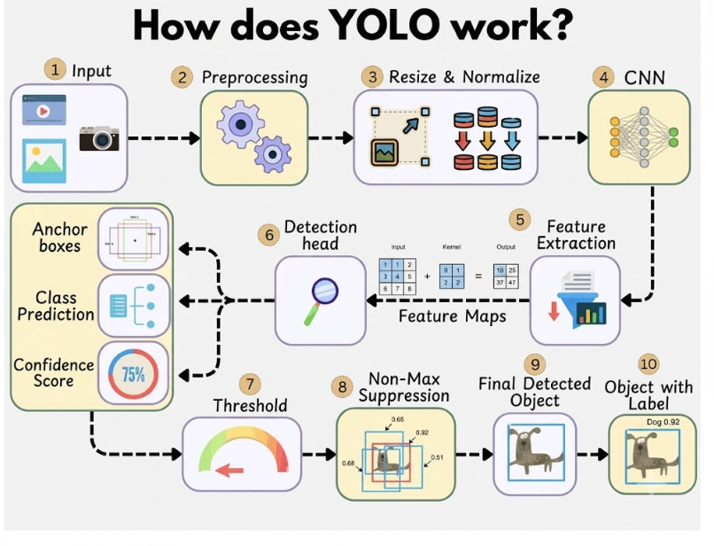
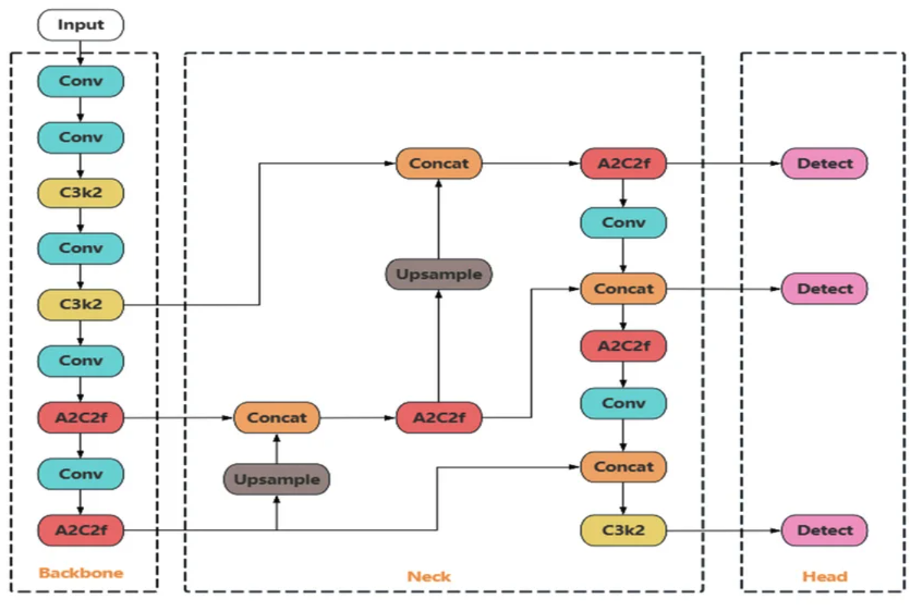
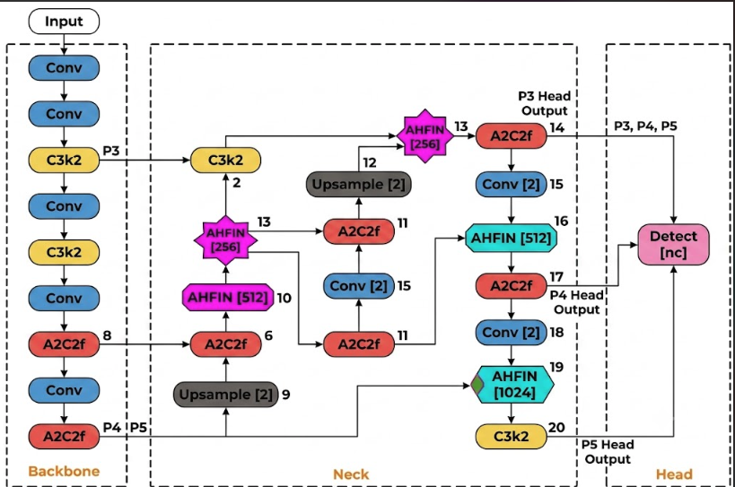
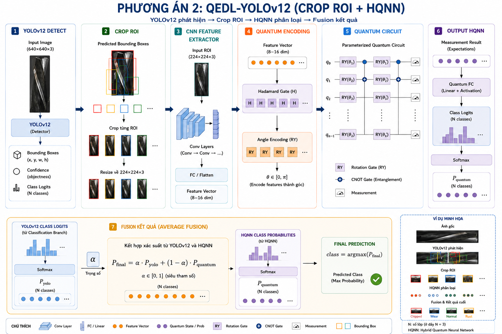
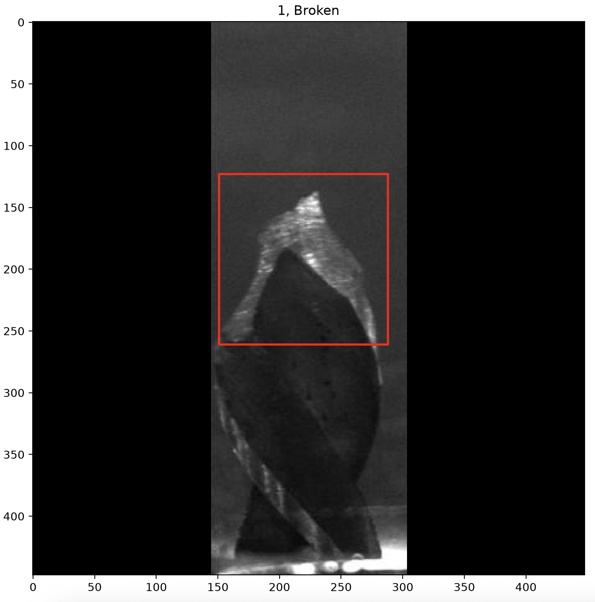
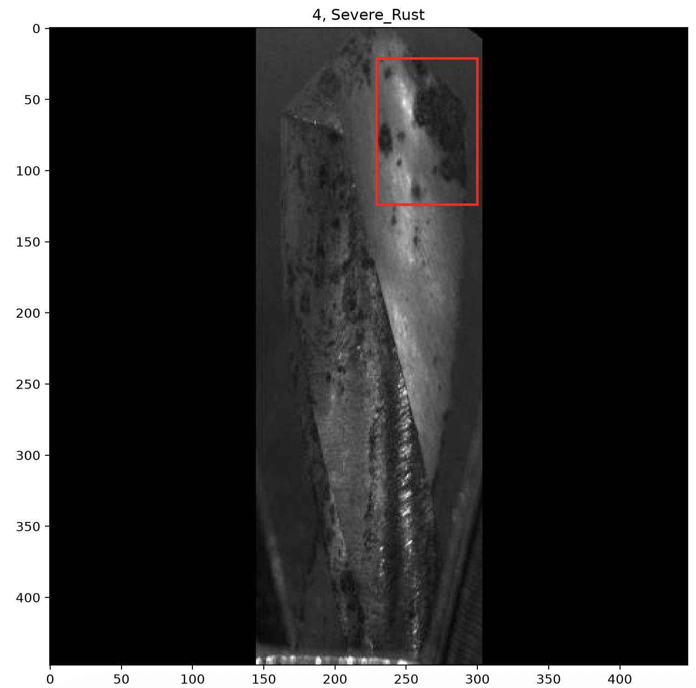
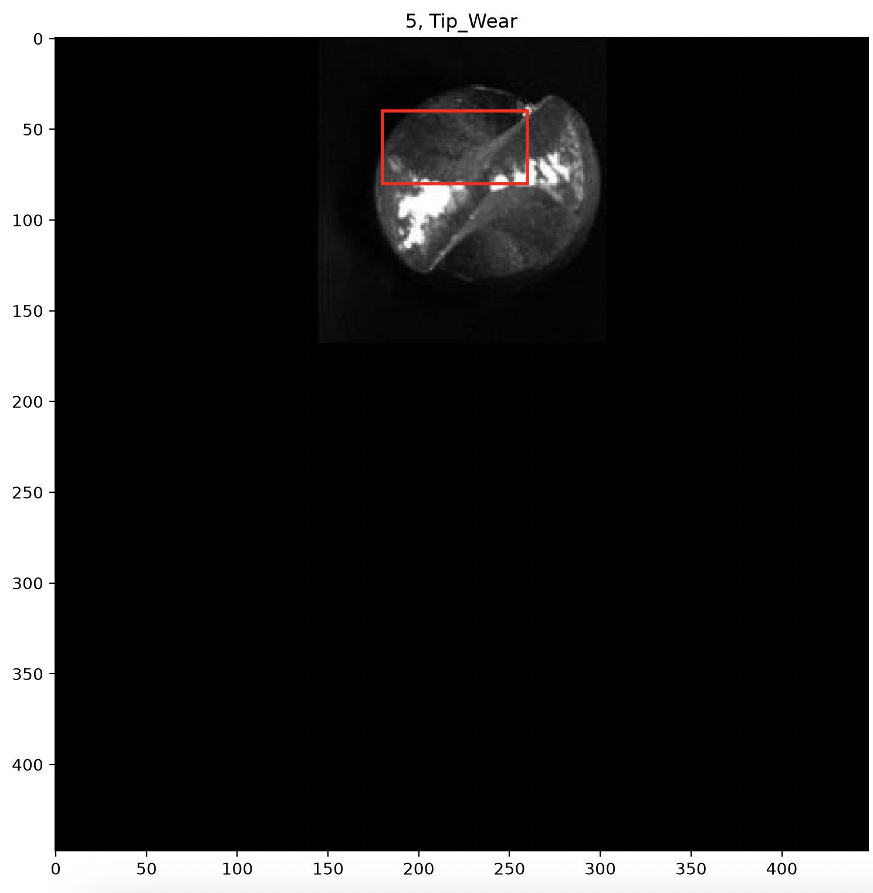
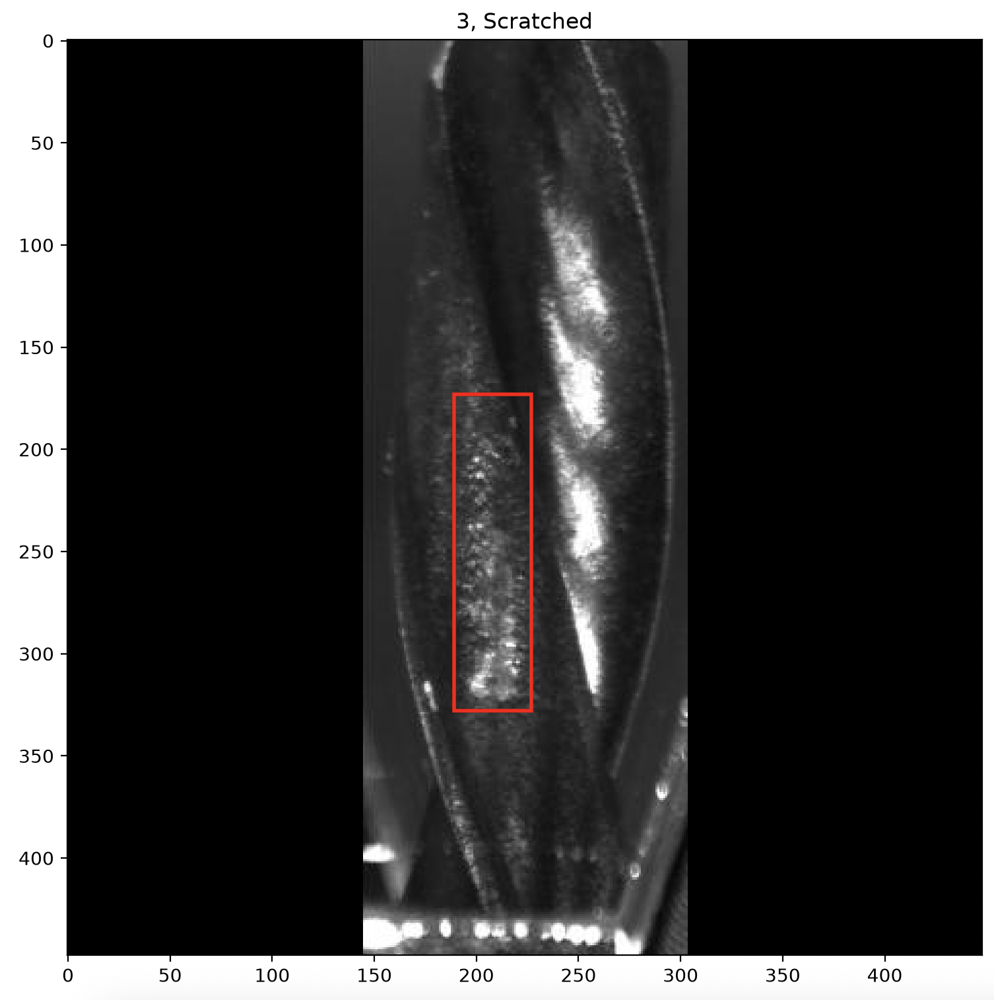
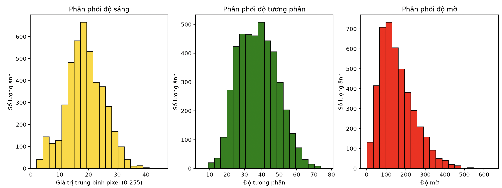
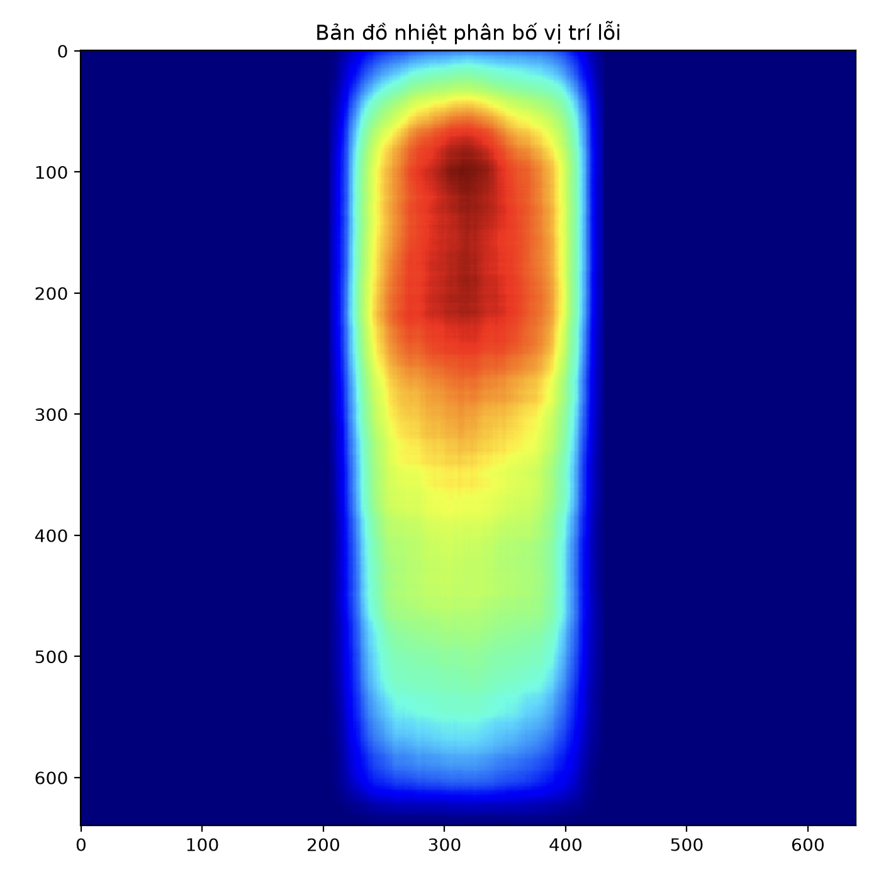

<div align="center">
  <h1>🛠️ Drill Bit Defect Detection</h1>
  <p>Hệ thống tự động phát hiện và phân loại các lỗi trên mũi khoan sử dụng trí tuệ nhân tạo (YOLO) kết hợp giao diện Web hiện đại.</p>
  
  <a href="https://canva.link/zr4io2buqf924sv">📚 Tài liệu quá trình thực hiện (Canva)</a>
</div>

---

## 🚀 Giới thiệu
Dự án này tập trung vào việc giải quyết bài toán kiểm định chất lượng mũi khoan trong công nghiệp. Bằng việc phân tích dữ liệu hình ảnh (EDA) và áp dụng mô hình Deep Learning (YOLOv12), hệ thống có khả năng nhận diện chính xác các lỗi phổ biến trên mũi khoan, giúp tiết kiệm thời gian và nâng cao độ chính xác so với việc kiểm tra thủ công.

## 🧠 Kiến trúc Model & Custom Architecture

Các kiến trúc custom được lưu trong thư mục [`architectures`](architectures) của project GitHub: [GiaThinh110605/Drill_Bit_Defect_Detection](https://github.com/GiaThinh110605/Drill_Bit_Defect_Detection/).

<div align="center">
  <h3>YOLO Pipeline tổng quát</h3>
  
</div>

YOLO xử lý ảnh qua các bước chính: tiền xử lý, resize/normalize, trích xuất đặc trưng bằng CNN, detection head dự đoán bounding box/class/confidence, sau đó lọc bằng threshold và Non-Max Suppression để tạo nhãn cuối cùng.

<div align="center">
  <h3>YOLOv12 Baseline Architecture</h3>
  
</div>

YOLOv12 baseline gồm 3 phần chính: **Backbone** trích xuất đặc trưng bằng các khối `Conv`, `C3k2`, `A2C2f`; **Neck** hợp nhất đặc trưng đa tỉ lệ qua `Concat` và `Upsample`; **Head** phát hiện lỗi trên các scale khác nhau.

<div align="center">
  <h3>YOLOv12 + AHFIN Custom</h3>
  
</div>

Kiến trúc custom **YOLOv12-AHFIN** bổ sung các khối `AHFIN` vào Neck/Head để tăng khả năng hợp nhất đặc trưng đa tỉ lệ, đặc biệt hữu ích với lỗi nhỏ, vùng lỗi mờ hoặc lỗi có biên dạng phức tạp trên mũi khoan. Các output `P3`, `P4`, `P5` vẫn được đưa vào Detect head để giữ khả năng phát hiện ở nhiều kích thước vật thể.

<div align="center">
  <h3>Hybrid Quantum QEDL-YOLOv12</h3>
  
</div>

Kiến trúc **QEDL-YOLOv12** dùng YOLOv12 làm detector ban đầu, crop từng ROI từ bounding box, sau đó đưa ROI vào HQNN classifier. Nhánh HQNN gồm CNN feature extractor, quantum encoding, parameterized quantum circuit và classifier. Kết quả cuối được fusion bằng trung bình xác suất:

```text
P_final = 1/2 * (P_yolo + P_quantum)
```

Nhờ fusion, mô hình tăng Recall/F1 trong thí nghiệm, nhưng FPS giảm vì mỗi ROI cần thêm bước crop, preprocess và phân loại bằng HQNN.

## 📈 Dashboard đánh giá Models

Dashboard dưới đây tổng hợp các kết quả đã lưu trong thư mục [`Models`](Models). Bảng **Training Results** lấy từ `runs/detect/train/results.csv` và chọn epoch tốt nhất theo `mAP@0.5:0.95`. Bảng **Notebook Evaluation / Inference** lấy từ output đã lưu trong các notebook, bao gồm cả FPS/latency khi notebook có đo tốc độ.

### 🏆 Training Results từ `results.csv`

| Rank | Model | Epochs | Best epoch | Precision | Recall | F1 | mAP@0.5 | mAP@0.5:0.95 | Final mAP@0.5:0.95 | Source |
|---:|---|---:|---:|---:|---:|---:|---:|---:|---:|---|
| 1 | `yolo_v9` | 100 | 61 | 0.785 | 0.723 | 0.753 | 0.797 | **0.449** | 0.437 | [`results.csv`](Models/yolo_v9/results/runs/detect/train/results.csv) |
| 2 | `yolo_v12` | 100 | 50 | 0.762 | 0.730 | 0.746 | 0.784 | **0.430** | 0.400 | [`results.csv`](Models/yolo_v12/results/runs/detect/train/results.csv) |
| 3 | `yolo_v8` | 100 | 43 | 0.816 | 0.704 | 0.756 | 0.791 | **0.430** | 0.405 | [`results.csv`](Models/yolo_v8/results/runs/detect/train/results.csv) |
| 4 | `yolo_v26` | 100 | 47 | 0.732 | 0.754 | 0.743 | 0.778 | **0.430** | 0.408 | [`results.csv`](Models/yolo_v26/results/runs/detect/train/results.csv) |
| 5 | `yolov12_300epochs` | 152 | 52 | 0.748 | 0.728 | 0.738 | 0.780 | **0.423** | 0.406 | [`results.csv`](Models/yolov12_300epochs/results/runs/detect/train/results.csv) |
| 6 | `yolo_v11` | 100 | 53 | 0.781 | 0.732 | 0.756 | 0.791 | **0.422** | 0.404 | [`results.csv`](Models/yolo_v11/results/runs/detect/train/results.csv) |
| 7 | `yolo_v10` | 100 | 63 | 0.753 | 0.694 | 0.722 | 0.755 | **0.412** | 0.391 | [`results.csv`](Models/yolo_v10/results/runs/detect/train/results.csv) |

**Nhận xét nhanh:** `yolo_v9` đang có `mAP@0.5:0.95` tốt nhất trong các run có `results.csv` (`0.449`). `yolo_v26` có Recall cao nhất trong nhóm này (`0.754`), còn `yolo_v8` có Precision cao nhất (`0.816`).

### ⚡ Notebook Evaluation / Inference

| Model / Run | Precision | Recall | F1 | mAP@0.5 | mAP@0.5:0.95 | FPS | Latency | Source |
|---|---:|---:|---:|---:|---:|---:|---:|---|
| `QEDL-YOLOv12 Fusion (result_cpu)` | 0.806 | 0.850 | 0.827 | 0.806 | **0.480** | 16.5 | 60.6 ms | [`notebook`](https://github.com/GiaThinh110605/Drill_Bit_Defect_Detection/blob/main/Models/hybrid_quantum_yolov12/result_cpu/hybrid_quantum.ipynb) |
| `QEDL-YOLOv12 Fusion (result_gpu_T4_Kaggle)` | 0.806 | 0.850 | 0.827 | 0.806 | **0.480** | 18.1 | 55.3 ms | [`notebook`](https://github.com/GiaThinh110605/Drill_Bit_Defect_Detection/blob/main/Models/hybrid_quantum_yolov12/result_gpu_T4_Kaggle/gpu.ipynb) |
| `Hybrid YOLOv12 gốc (result_cpu)` | 0.803 | 0.754 | 0.776 | 0.811 | **0.443** | 18.7 | 53.6 ms | [`notebook`](https://github.com/GiaThinh110605/Drill_Bit_Defect_Detection/blob/main/Models/hybrid_quantum_yolov12/result_cpu/hybrid_quantum.ipynb) |
| `Hybrid YOLOv12 gốc (result_gpu_T4_Kaggle)` | 0.803 | 0.754 | 0.778 | 0.811 | **0.443** | 60.3 | 16.6 ms | [`notebook`](https://github.com/GiaThinh110605/Drill_Bit_Defect_Detection/blob/main/Models/hybrid_quantum_yolov12/result_gpu_T4_Kaggle/gpu.ipynb) |
| `yolo_v9` | 0.774 | 0.753 | 0.745 | 0.786 | **0.438** | 188.5 | 5.3 ms | [`notebook`](https://github.com/GiaThinh110605/Drill_Bit_Defect_Detection/blob/main/Models/yolo_v9/notebook112f18967c.ipynb) |
| `yolo_v26` | 0.792 | 0.743 | 0.696 | 0.764 | **0.408** | 298.1 | 3.4 ms | [`notebook`](https://github.com/GiaThinh110605/Drill_Bit_Defect_Detection/blob/main/Models/yolo_v26/notebook99c8751bfe.ipynb) |
| `yolov12_300epochs` | 0.779 | 0.752 | 0.742 | 0.754 | **0.406** | 193.9 | 5.2 ms | [`notebook`](https://github.com/GiaThinh110605/Drill_Bit_Defect_Detection/blob/main/Models/yolov12_300epochs/notebookc97904729c.ipynb) |
| `yolo12_innerciou` | 0.799 | 0.722 | 0.750 | 0.750 | **0.406** | 196.4 | 5.1 ms | [`notebook`](https://github.com/GiaThinh110605/Drill_Bit_Defect_Detection/blob/main/Models/yolo12_innerciou/notebook58a0b72e7a.ipynb) |
| `yolo_v8` | 0.768 | 0.737 | 0.692 | 0.775 | **0.405** | 223.6 | 4.5 ms | [`notebook`](https://github.com/GiaThinh110605/Drill_Bit_Defect_Detection/blob/main/Models/yolo_v8/notebookd929110b51.ipynb) |
| `yolo_v11` | 0.783 | 0.729 | 0.714 | 0.776 | **0.404** | 227.4 | 4.4 ms | [`notebook`](https://github.com/GiaThinh110605/Drill_Bit_Defect_Detection/blob/main/Models/yolo_v11/notebook72a7dfe82a.ipynb) |
| `yolov12_AHFIN` | 0.791 | 0.696 | 0.745 | 0.737 | **0.403** | 172.6 | 5.8 ms | [`notebook`](https://github.com/GiaThinh110605/Drill_Bit_Defect_Detection/blob/main/Models/yolov12_AHFIN/notebookdffa5385fe%20%282%29.ipynb) |
| `yolo_v12` | 0.764 | 0.741 | 0.706 | 0.753 | **0.400** | 181.9 | 5.5 ms | [`notebook`](https://github.com/GiaThinh110605/Drill_Bit_Defect_Detection/blob/main/Models/yolo_v12/notebookce70d09836.ipynb) |
| `yolo12_AHFIN_INNERCIOU` | 0.781 | 0.717 | 0.749 | 0.761 | **0.399** | 178.7 | 5.6 ms | [`notebook`](https://github.com/GiaThinh110605/Drill_Bit_Defect_Detection/blob/main/Models/yolo12_AHFIN_INNERCIOU/notebook344e3d24e2.ipynb) |
| `yolo_v10` | 0.743 | 0.719 | 0.697 | 0.725 | **0.391** | 269.2 | 3.7 ms | [`notebook`](https://github.com/GiaThinh110605/Drill_Bit_Defect_Detection/blob/main/Models/yolo_v10/notebookb84e69e7e3.ipynb) |

**Kết luận:** QEDL-YOLOv12 Fusion cho Recall và F1 cao nhất (`Recall = 0.850`, `F1 = 0.827`, `mAP@0.5:0.95 = 0.480`) nhưng tốc độ thấp hơn YOLO-only do chạy thêm HQNN/quantum classifier trên từng ROI. Nếu ưu tiên real-time, `yolo_v26` có FPS cao nhất trong các notebook đã đo (`298.1 FPS`), còn `Hybrid YOLOv12 gốc` trên T4 đạt `60.3 FPS` với `mAP@0.5 = 0.811`.

## 📊 Phân tích Dữ liệu (EDA) & Trực quan hóa
Quá trình **Exploratory Data Analysis (EDA)** được thực hiện nhằm hiểu rõ phân phối của dữ liệu và các đặc trưng của từng loại lỗi trước khi tiến hành huấn luyện mô hình.

<div align="center">
  <h3>Các loại lỗi trên mũi khoan</h3>
  <table>
    <tr>
      <td align="center">
        
        <br /><b>Broken (Gãy)</b>
      </td>
      <td align="center">
        
        <br /><b>Severe Rust (Rỉ sét nặng)</b>
      </td>
    </tr>
    <tr>
      <td align="center">
        
        <br /><b>Tip Wear (Mòn đầu)</b>
      </td>
      <td align="center">
        
        <br /><b>Scratched (Trầy xước)</b>
      </td>
    </tr>
  </table>
  
  <h3>Phân phối & Tương quan Dữ liệu</h3>
  <table>
    <tr>
      <td align="center">
        
        <br /><b>Biểu đồ phân phối lỗi (Histogram)</b>
      </td>
      <td align="center">
        
        <br /><b>Bản đồ nhiệt (Heatmap)</b>
      </td>
    </tr>
  </table>
</div>

## 🛠️ Quá trình Tiền xử lý (Data Preprocessing)
- Chuyển đổi định dạng Annotation từ COCO sang YOLO chuẩn.
- Crop (cắt) vùng lỗi chính trên ảnh để tối ưu hóa đầu vào, giúp quá trình training diễn ra nhanh hơn và tối ưu hóa tài nguyên phần cứng (RAM/VRAM).

## 💡 Kỹ năng đúc kết được
- **Kỹ năng Debug:** Rèn luyện thói quen print và trực quan hóa (visualize) dữ liệu mẫu trước khi chạy dữ liệu thực tế để tránh làm hỏng tập dữ liệu.
- **Kỹ năng Nghiên cứu:** Đọc hiểu và tham khảo các tài liệu, bài báo khoa học (Research Papers) về Computer Vision.
- **Giao tiếp Kỹ thuật:** Nâng cao khả năng diễn giải, giải thích code logic do bản thân/AI viết một cách mạch lạc cho người khác hiểu.

## ⚙️ Công nghệ & Công cụ
- **AI & Deep Learning:** Python, PyTorch, YOLOv12, OpenCV.
- **Backend:** FastAPI.
- **Frontend:** React, Vite.
- **DevOps & MLOps:** Docker, GitHub Actions (CI/CD), Hugging Face Spaces (Deployment).
- **Trợ lý AI:** Sử dụng Antigravity, Gemini để hỗ trợ lên kế hoạch, đọc hiểu source code phức tạp và gỡ lỗi (debug).

## 🔗 Tài liệu tham khảo
- Hướng dẫn chuyển đổi dữ liệu COCO sang định dạng YOLO: [Link tới file json mẫu](original-data/train/_annotations.coco.json)
- Slide fastapi: [Link tới file slide](https://canva.link/840ya322qx6ytve)
- Slide deep learning: [Link tới file slide](https://canva.link/6xdb3n1gpijx1kw)
- Quantum model: [Link tới file slide](https://canva.link/xbnml6xwiar58hc)
- ultralytics custom Yolov12: [Link tới github](https://github.com/GiaThinh110605/ultralytics)
