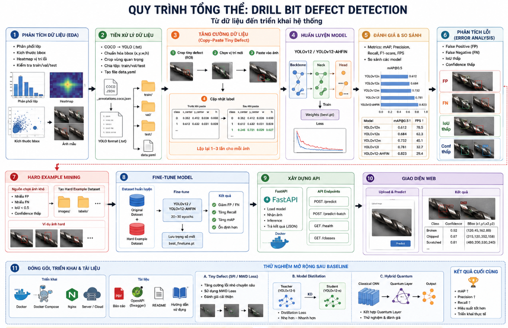
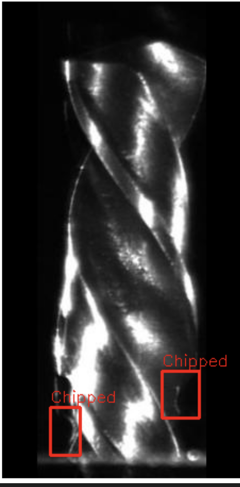
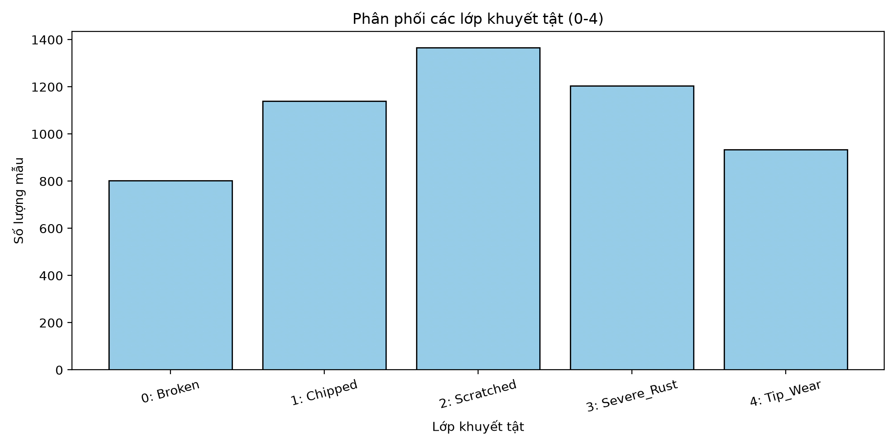

<div align="center">
  <h1>Drill Bit Defect Detection</h1>
  <p>Hệ thống phát hiện và phân loại lỗi trên mũi khoan bằng YOLO, kết hợp EDA, tiền xử lý dữ liệu, đánh giá model, API và giao diện Web.</p>

  
</div>

---

## 1. Tổng quan bài toán

Dự án giải quyết bài toán kiểm định chất lượng mũi khoan trong công nghiệp. Thay vì kiểm tra thủ công, hệ thống sử dụng mô hình object detection để nhận diện vị trí lỗi trên ảnh và phân loại lỗi theo từng nhóm cụ thể.

Luồng triển khai của dự án được tổ chức theo đúng thứ tự:

1. Phân tích dữ liệu ban đầu.
2. Tiền xử lý và chuẩn hóa annotation.
3. Tăng cường dữ liệu.
4. Huấn luyện các mô hình YOLO.
5. Nghiên cứu hướng custom architecture và hybrid quantum.
6. Đánh giá, so sánh kết quả.
7. Phân tích lỗi sau inference.
8. Thử nghiệm mở rộng sau baseline: tiny defect, model distillation và quantum.
9. Xây dựng API phục vụ inference.
10. Xây dựng giao diện Web.
11. Chuẩn bị đóng gói, triển khai và tài liệu tham khảo.

## 2. Dữ liệu

Dataset gốc nằm trong thư mục [`original-data`](original-data) và sử dụng annotation dạng COCO JSON. Ảnh được chia thành các tập `train`, `valid` và `test`.

Các lớp lỗi trong bài toán:

| Class | Ý nghĩa |
|---|---|
| `drill` | Mũi khoan / lớp nền |
| `Broken` | Gãy |
| `Chipped` | Mẻ |
| `Scratched` | Trầy xước |
| `Severe_Rust` | Rỉ sét nặng |
| `Tip_Wear` | Mòn đầu |

Các phiên bản dữ liệu trong repo:

| Thư mục | Vai trò |
|---|---|
| [`original-data`](original-data) | Dữ liệu gốc theo định dạng COCO |
| [`preprocessed-data`](preprocessed-data) | Dữ liệu sau tiền xử lý |
| [`final-dataset`](final-dataset) | Dữ liệu cuối dùng cho YOLO, có [`data.yaml`](final-dataset/data.yaml) |

## 3. Phân tích dữ liệu EDA

Trước khi huấn luyện model, dự án thực hiện EDA để hiểu rõ phân phối dữ liệu, kích thước bounding box, sự khác biệt giữa các loại lỗi và các vấn đề có thể ảnh hưởng đến quá trình train.

Các bước EDA chính:

| Bước | Mục đích |
|---|---|
| Phân phối class | Kiểm tra dữ liệu có bị lệch lớp hay không |
| Phân tích bounding box | Xem lỗi thường nhỏ, lớn, dài hay tập trung ở vùng nào |
| Trực quan hóa ảnh mẫu | Kiểm tra annotation và đặc điểm lỗi bằng mắt |
| Kiểm tra train/valid/test | Đảm bảo chia tập hợp lý trước khi train |

<div align="center">
  <h3>Các loại lỗi trên mũi khoan</h3>
  <table>
    <tr>
      <td align="center">
        
        <br /><b>Broken (Gãy)</b>
      </td>
      <td align="center">
        
        <br /><b>Severe Rust (Rỉ sét nặng)</b>
      </td>
    </tr>
    <tr>
      <td align="center">
        
        <br /><b>Tip Wear (Mòn đầu)</b>
      </td>
      <td align="center">
        
        <br /><b>Scratched (Trầy xước)</b>
      </td>
    </tr>
    <tr>
      <td align="center">
        
        <br /><b>Chipped (Sứt mẻ)</b>
      </td>
    </tr>
  </table>

  <h3>Class Distribution</h3>
  <table>
    <tr>
      <td align="center">
        
        <br /><b>Biểu đồ phân phối lỗi</b>
      </td>
    </tr>
  </table>

  <h3>Phân phối và tương quan dữ liệu</h3>
  <table>
    <tr>
      <td align="center">
        
        <br /><b>Biểu đồ phân phối lỗi</b>
      </td>
      <td align="center">
        
        <br /><b>Bản đồ nhiệt vị trí lỗi</b>
      </td>
    </tr>
  </table>
</div>

Chi tiết phần EDA nằm trong thư mục [`EDA`](EDA).

## 4. Tiền xử lý dữ liệu

Sau khi hiểu dữ liệu, bước tiếp theo là chuẩn hóa dữ liệu để phù hợp với YOLO.

Các xử lý chính:

| Công việc | Mô tả |
|---|---|
| COCO sang YOLO | Chuyển `_annotations.coco.json` thành file `.txt` theo format YOLO |
| Chuẩn hóa bbox | Đưa tọa độ về dạng `class_id x_center y_center width height`, normalized từ 0 đến 1 |
| Crop vùng lỗi | Cắt vùng quan trọng để tối ưu đầu vào và giảm nhiễu không cần thiết |
| Chuẩn bị `data.yaml` | Khai báo đường dẫn train/val/test và danh sách class |

Script và ghi chú liên quan nằm trong [`Data_Processing`](Data_Processing).

## 5. Tăng cường dữ liệu

Data augmentation giúp model ổn định hơn khi gặp lỗi nhỏ, ánh sáng thay đổi hoặc số lượng mẫu giữa các class không cân bằng.

Các hướng augmentation phù hợp với bài toán:

| Nhóm | Kỹ thuật |
|---|---|
| Spatial | Flip, rotate, crop có kiểm soát |
| Lighting | Brightness/contrast, blur, noise |
| Defect-specific | Copy-paste vùng lỗi, oversampling class hiếm |
| YOLO native | Mosaic, MixUp |

Sau augmentation cần trực quan hóa lại ảnh và bounding box để tránh lỗi bbox lệch, bbox bị cắt hoặc vùng lỗi trở nên khó nhìn bằng mắt thường.

## 6. Model và kiến trúc

Dự án sử dụng YOLO làm hướng chính vì phù hợp với object detection thời gian thực. Ngoài các YOLO baseline, repo còn thử nghiệm custom architecture và hướng hybrid quantum.

### 6.1 YOLO pipeline tổng quát

<div align="center">
  
</div>

YOLO xử lý ảnh qua các bước: tiền xử lý, resize/normalize, trích xuất đặc trưng bằng CNN, detection head dự đoán bounding box/class/confidence, sau đó lọc bằng threshold và Non-Max Suppression để tạo kết quả cuối.

### 6.2 YOLOv12 baseline

<div align="center">
  
</div>

YOLOv12 baseline gồm 3 phần chính:

| Thành phần | Vai trò |
|---|---|
| Backbone | Trích xuất đặc trưng bằng các khối `Conv`, `C3k2`, `A2C2f` |
| Neck | Hợp nhất đặc trưng đa tỉ lệ bằng `Concat` và `Upsample` |
| Head | Phát hiện lỗi trên nhiều scale khác nhau |

### 6.3 YOLOv12-AHFIN custom

<div align="center">
  
</div>

Kiến trúc custom **YOLOv12-AHFIN** bổ sung các khối `AHFIN` vào Neck/Head để tăng khả năng hợp nhất đặc trưng đa tỉ lệ. Hướng này đặc biệt phù hợp với lỗi nhỏ, vùng lỗi mờ hoặc lỗi có biên dạng phức tạp trên mũi khoan.

### 6.4 Hybrid Quantum QEDL-YOLOv12

<div align="center">
  
</div>

Kiến trúc **QEDL-YOLOv12** dùng YOLOv12 làm detector ban đầu, crop từng ROI từ bounding box, sau đó đưa ROI vào HQNN classifier. Nhánh HQNN gồm CNN feature extractor, quantum encoding, parameterized quantum circuit và classifier.

Kết quả cuối được fusion bằng trung bình xác suất:

```text
P_final = 1/2 * (P_yolo + P_quantum)
```

Hướng hybrid quantum giúp tăng Recall/F1 trong thí nghiệm, nhưng FPS giảm vì mỗi ROI cần thêm bước crop, preprocess và phân loại bằng HQNN.

## 7. Huấn luyện

Quá trình huấn luyện sử dụng transfer learning từ các model YOLO pretrained. Các cấu hình chính cần quan tâm:

| Tham số | Gợi ý |
|---|---|
| `epochs` | 50-100 cho baseline, có thể tăng khi cần |
| `imgsz` | 448 hoặc 640 |
| `batch` | Tùy VRAM, thường 16 hoặc 32 |
| `optimizer` | `AdamW` hoặc `SGD` |
| `data` | [`final-dataset/data.yaml`](final-dataset/data.yaml) |

Các model và notebook huấn luyện/đánh giá được lưu trong [`Models`](Models).

## 8. Đánh giá model

Sau khi train, model được đánh giá bằng các metric chính:

| Metric | Ý nghĩa |
|---|---|
| Precision | Tỉ lệ dự đoán đúng trong các lỗi mà model đã dự đoán |
| Recall | Khả năng phát hiện đủ lỗi thật |
| F1 | Cân bằng giữa Precision và Recall |
| mAP@0.5 | Mean Average Precision tại IoU 0.5 |
| mAP@0.5:0.95 | Metric nghiêm ngặt hơn, trung bình trên nhiều ngưỡng IoU |
| FPS / Latency | Tốc độ inference |

### 8.1 Training results từ `results.csv`

Bảng này lấy từ `runs/detect/train/results.csv` và chọn epoch tốt nhất theo `mAP@0.5:0.95`.

| Rank | Model | Epochs | Best epoch | Precision | Recall | F1 | mAP@0.5 | mAP@0.5:0.95 | Final mAP@0.5:0.95 | Source |
|---:|---|---:|---:|---:|---:|---:|---:|---:|---:|---|
| 1 | `yolo_v9` | 100 | 61 | 0.785 | 0.723 | 0.753 | 0.797 | **0.449** | 0.437 | [`results.csv`](Models/yolo_v9/results/runs/detect/train/results.csv) |
| 2 | `yolo_v12` | 100 | 50 | 0.762 | 0.730 | 0.746 | 0.784 | **0.430** | 0.400 | [`results.csv`](Models/yolo_v12/results/runs/detect/train/results.csv) |
| 3 | `yolo_v8` | 100 | 43 | 0.816 | 0.704 | 0.756 | 0.791 | **0.430** | 0.405 | [`results.csv`](Models/yolo_v8/results/runs/detect/train/results.csv) |
| 4 | `yolo_v26` | 100 | 47 | 0.732 | 0.754 | 0.743 | 0.778 | **0.430** | 0.408 | [`results.csv`](Models/yolo_v26/results/runs/detect/train/results.csv) |
| 5 | `yolov12_300epochs` | 152 | 52 | 0.748 | 0.728 | 0.738 | 0.780 | **0.423** | 0.406 | [`results.csv`](Models/yolov12_300epochs/results/runs/detect/train/results.csv) |
| 6 | `yolo_v11` | 100 | 53 | 0.781 | 0.732 | 0.756 | 0.791 | **0.422** | 0.404 | [`results.csv`](Models/yolo_v11/results/runs/detect/train/results.csv) |
| 7 | `yolo_v10` | 100 | 63 | 0.753 | 0.694 | 0.722 | 0.755 | **0.412** | 0.391 | [`results.csv`](Models/yolo_v10/results/runs/detect/train/results.csv) |

Nhận xét nhanh: `yolo_v9` có `mAP@0.5:0.95` tốt nhất trong các run có `results.csv` (`0.449`). `yolo_v26` có Recall cao nhất trong nhóm này (`0.754`), còn `yolo_v8` có Precision cao nhất (`0.816`).

### 8.2 Notebook evaluation / inference

Bảng này lấy từ output đã lưu trong các notebook, bao gồm FPS/latency khi notebook có đo tốc độ.

| Model / Run | Precision | Recall | F1 | mAP@0.5 | mAP@0.5:0.95 | FPS | Latency | Source |
|---|---:|---:|---:|---:|---:|---:|---:|---|
| `QEDL-YOLOv12 Fusion (result_cpu)` | 0.806 | 0.850 | 0.827 | 0.806 | **0.480** | 16.5 | 60.6 ms | [`notebook`](https://github.com/GiaThinh110605/Drill_Bit_Defect_Detection/blob/main/Models/hybrid_quantum_yolov12/result_cpu/hybrid_quantum.ipynb) |
| `QEDL-YOLOv12 Fusion (result_gpu_T4_Kaggle)` | 0.806 | 0.850 | 0.827 | 0.806 | **0.480** | 18.1 | 55.3 ms | [`notebook`](https://github.com/GiaThinh110605/Drill_Bit_Defect_Detection/blob/main/Models/hybrid_quantum_yolov12/result_gpu_T4_Kaggle/gpu.ipynb) |
| `Hybrid YOLOv12 gốc (result_cpu)` | 0.803 | 0.754 | 0.776 | 0.811 | **0.443** | 18.7 | 53.6 ms | [`notebook`](https://github.com/GiaThinh110605/Drill_Bit_Defect_Detection/blob/main/Models/hybrid_quantum_yolov12/result_cpu/hybrid_quantum.ipynb) |
| `Hybrid YOLOv12 gốc (result_gpu_T4_Kaggle)` | 0.803 | 0.754 | 0.778 | 0.811 | **0.443** | 60.3 | 16.6 ms | [`notebook`](https://github.com/GiaThinh110605/Drill_Bit_Defect_Detection/blob/main/Models/hybrid_quantum_yolov12/result_gpu_T4_Kaggle/gpu.ipynb) |
| `yolo_v9` | 0.774 | 0.753 | 0.745 | 0.786 | **0.438** | 188.5 | 5.3 ms | [`notebook`](https://github.com/GiaThinh110605/Drill_Bit_Defect_Detection/blob/main/Models/yolo_v9/notebook112f18967c.ipynb) |
| `yolo_v26` | 0.792 | 0.743 | 0.696 | 0.764 | **0.408** | 298.1 | 3.4 ms | [`notebook`](https://github.com/GiaThinh110605/Drill_Bit_Defect_Detection/blob/main/Models/yolo_v26/notebook99c8751bfe.ipynb) |
| `yolov12_300epochs` | 0.779 | 0.752 | 0.742 | 0.754 | **0.406** | 193.9 | 5.2 ms | [`notebook`](https://github.com/GiaThinh110605/Drill_Bit_Defect_Detection/blob/main/Models/yolov12_300epochs/notebookc97904729c.ipynb) |
| `yolo12_innerciou` | 0.799 | 0.722 | 0.750 | 0.750 | **0.406** | 196.4 | 5.1 ms | [`notebook`](https://github.com/GiaThinh110605/Drill_Bit_Defect_Detection/blob/main/Models/yolo12_innerciou/notebook58a0b72e7a.ipynb) |
| `yolo_v8` | 0.768 | 0.737 | 0.692 | 0.775 | **0.405** | 223.6 | 4.5 ms | [`notebook`](https://github.com/GiaThinh110605/Drill_Bit_Defect_Detection/blob/main/Models/yolo_v8/notebookd929110b51.ipynb) |
| `yolo_v11` | 0.783 | 0.729 | 0.714 | 0.776 | **0.404** | 227.4 | 4.4 ms | [`notebook`](https://github.com/GiaThinh110605/Drill_Bit_Defect_Detection/blob/main/Models/yolo_v11/notebook72a7dfe82a.ipynb) |
| `yolov12_AHFIN` | 0.791 | 0.696 | 0.745 | 0.737 | **0.403** | 172.6 | 5.8 ms | [`notebook`](https://github.com/GiaThinh110605/Drill_Bit_Defect_Detection/blob/main/Models/yolov12_AHFIN/notebookdffa5385fe%20%282%29.ipynb) |
| `yolo_v12` | 0.764 | 0.741 | 0.706 | 0.753 | **0.400** | 181.9 | 5.5 ms | [`notebook`](https://github.com/GiaThinh110605/Drill_Bit_Defect_Detection/blob/main/Models/yolo_v12/notebookce70d09836.ipynb) |
| `yolo12_AHFIN_INNERCIOU` | 0.781 | 0.717 | 0.749 | 0.761 | **0.399** | 178.7 | 5.6 ms | [`notebook`](https://github.com/GiaThinh110605/Drill_Bit_Defect_Detection/blob/main/Models/yolo12_AHFIN_INNERCIOU/notebook344e3d24e2.ipynb) |
| `yolo_v10` | 0.743 | 0.719 | 0.697 | 0.725 | **0.391** | 269.2 | 3.7 ms | [`notebook`](https://github.com/GiaThinh110605/Drill_Bit_Defect_Detection/blob/main/Models/yolo_v10/notebookb84e69e7e3.ipynb) |

Kết luận: QEDL-YOLOv12 Fusion cho Recall và F1 cao nhất (`Recall = 0.850`, `F1 = 0.827`, `mAP@0.5:0.95 = 0.480`) nhưng tốc độ thấp hơn YOLO-only do chạy thêm HQNN/quantum classifier trên từng ROI. Nếu ưu tiên real-time, `yolo_v26` có FPS cao nhất trong các notebook đã đo (`298.1 FPS`).

## 9. Inference và phân tích lỗi

Sau khi chọn model, cần chạy inference trên tập test và xem lại các ảnh dự đoán để phân tích lỗi.

Các điểm cần kiểm tra:

| Vấn đề | Câu hỏi cần trả lời |
|---|---|
| False Positive | Model có nhận nhầm phản chiếu ánh sáng thành lỗi không? |
| False Negative | Model có bỏ sót lỗi nhỏ như mẻ đầu hoặc trầy nhẹ không? |
| Confusion | Model có nhầm `Broken` với `Chipped` hoặc các lỗi tương tự không? |
| Tốc độ | Model có đủ nhanh cho nhu cầu real-time không? |

## 10. Hướng thử nghiệm tiếp theo sau baseline

Các hướng dưới đây là phần thử nghiệm mở rộng sau khi đã có kết quả train YOLO baseline. Mục tiêu là cải thiện khả năng phát hiện lỗi nhỏ, giảm kích thước model khi triển khai và nghiên cứu thêm hướng hybrid quantum.

### 10.1 Tăng cường lỗi nhỏ và train tiny defect

Hướng này tập trung vào các lỗi nhỏ, khó phát hiện hoặc thường bị model bỏ sót sau khi inference trên tập test.

Pipeline thử nghiệm:

```text
Dataset
   |
   v
Copy-Paste Tiny Defect
   |
   v
Train YOLO
   |
   v
Lưu các ảnh dự đoán sai
   |
   v
Hard Example Mining
   |
   v
Fine-tune thêm 20-30 epoch
```

Ý nghĩa từng bước:

| Bước | Mục đích |
|---|---|
| Copy-Paste Tiny Defect | Cắt các vùng lỗi nhỏ và dán vào ảnh khác để tăng số lượng mẫu tiny defect |
| Train YOLO | Train lại model với dữ liệu đã tăng cường lỗi nhỏ |
| Lưu ảnh dự đoán sai | Thu thập ảnh false positive, false negative và các case confidence thấp |
| Hard Example Mining | Đưa các mẫu khó vào tập train/fine-tune để model học lại các trường hợp hay nhầm |
| Fine-tune 20-30 epoch | Tiếp tục train từ checkpoint tốt nhất để cải thiện Recall/F1 cho lỗi nhỏ |

Metric cần theo dõi riêng cho hướng này:

| Metric | Lý do theo dõi |
|---|---|
| Recall của class lỗi nhỏ | Kiểm tra model có bỏ sót ít hơn không |
| mAP theo từng class | Xem class nào được cải thiện rõ nhất |
| False Negative count | Đánh giá trực tiếp số lỗi thật bị bỏ sót |
| FPS / latency | Đảm bảo fine-tune không làm pipeline inference chậm bất thường |

### 10.2 Chưng cất model từ YOLOv12l sang YOLOv12n

Hướng này dùng model lớn **YOLOv12l** làm teacher và model nhỏ **YOLOv12n** làm student.

Mục tiêu:

| Model | Vai trò |
|---|---|
| YOLOv12l | Teacher model, học đặc trưng tốt hơn nhưng nặng hơn |
| YOLOv12n | Student model, nhẹ hơn và phù hợp triển khai real-time |

Quy trình thử nghiệm:

1. Train hoặc chọn checkpoint YOLOv12l có metric tốt.
2. Dùng YOLOv12l sinh soft labels hoặc prediction targets cho tập train/valid.
3. Train YOLOv12n bằng ground-truth label kết hợp knowledge từ teacher.
4. So sánh YOLOv12n distillation với YOLOv12n baseline.

Tiêu chí đánh giá:

| Tiêu chí | Câu hỏi cần trả lời |
|---|---|
| Accuracy | YOLOv12n sau distillation có tăng mAP/Recall không? |
| Tốc độ | YOLOv12n vẫn giữ được FPS cao không? |
| Dung lượng | Model nhỏ có phù hợp để deploy hơn YOLOv12l không? |
| Tiny defect | Student có học tốt hơn các lỗi nhỏ từ teacher không? |

### 10.3 Quantum / Hybrid Quantum

Quantum là hướng nghiên cứu sau khi đã có detector YOLO hoạt động ổn định. Không dùng quantum để xử lý trực tiếp toàn bộ ảnh lớn, mà dùng YOLO/CNN để trích xuất đặc trưng trước, sau đó đưa embedding nhỏ vào quantum classifier.

Pipeline nghiên cứu:

```text
Image
   |
   v
YOLO / CNN Backbone
   |
   v
Feature Embedding
   |
   v
Dimension Reduction
   |
   v
Quantum Encoding
   |
   v
Parameterized Quantum Circuit
   |
   v
Defect Classification / Fusion
```

Các hướng thử nghiệm quantum:

| Hướng | Mô tả |
|---|---|
| Quantum classifier | Dùng HQNN phân loại ROI đã được YOLO crop |
| Quantum fusion | Kết hợp xác suất từ YOLO và quantum classifier |
| Feature reduction | Dùng PCA/autoencoder giảm embedding về số chiều phù hợp với số qubit |
| So sánh classical vs quantum | So sánh HQNN với classifier classical cùng đầu vào embedding |

Mục tiêu chính của phần quantum không phải thay thế YOLO, mà là kiểm tra liệu nhánh quantum có giúp cải thiện Recall/F1 hoặc khả năng phân biệt các lỗi khó hay không.

## 11. API backend

Backend nằm trong [`app/backend`](app/backend) và dùng FastAPI để phục vụ model qua REST API.

Luồng xử lý API:

1. Client gửi ảnh lên endpoint predict.
2. Backend đọc ảnh và đưa vào model YOLO.
3. Model trả về bounding boxes, class names và confidence scores.
4. Backend format kết quả thành JSON.
5. Frontend dùng kết quả đó để vẽ bounding box lên ảnh.

File chính: [`app/backend/main.py`](app/backend/main.py)

## 12. Giao diện Web

Frontend nằm trong [`app/frontend`](app/frontend), sử dụng React và Vite.

Mục tiêu giao diện:

| Chức năng | Mô tả |
|---|---|
| Upload ảnh | Người dùng chọn hoặc kéo thả ảnh mũi khoan |
| Gửi ảnh đến API | Frontend gọi backend để chạy inference |
| Hiển thị kết quả | Vẽ bounding box, class và confidence lên ảnh |
| Trải nghiệm trực quan | Giúp người dùng kiểm tra lỗi mà không cần dùng command line |

## 13. Đóng gói và triển khai

Theo roadmap, bước triển khai gồm Docker, CI/CD và hosting demo.

Các hướng triển khai:

| Hướng | Mục đích |
|---|---|
| Docker | Đóng gói backend/frontend để chạy ổn định ở môi trường khác |
| Docker Compose | Chạy API và UI cùng lúc |
| GitHub Actions | Tự động kiểm tra hoặc build khi push code |
| Hugging Face Spaces | Chia sẻ demo model dễ dàng |
| Render/Railway/Cloud Run | Triển khai API hoặc full app trên cloud |

Repo hiện có cấu trúc ứng dụng trong [`app`](app) và workflow trong [`.github/workflows`](.github/workflows).

## 14. Công nghệ sử dụng

| Nhóm | Công nghệ |
|---|---|
| Ngôn ngữ | Python, JavaScript |
| Computer Vision | OpenCV, YOLO, Ultralytics |
| Deep Learning | PyTorch |
| Backend | FastAPI |
| Frontend | React, Vite |
| Nghiên cứu mở rộng | Hybrid Quantum, HQNN |
| DevOps/MLOps | Docker, GitHub Actions, Hugging Face Spaces |

## 15. Kỹ năng đúc kết

Qua dự án, các kỹ năng chính được rèn luyện gồm:

| Kỹ năng | Nội dung |
|---|---|
| EDA | Hiểu dữ liệu trước khi train model |
| Debug dữ liệu | Luôn visualize annotation, bbox và ảnh mẫu trước khi chạy lớn |
| Training YOLO | Cấu hình dataset, train, theo dõi metric và chọn checkpoint |
| Đánh giá model | So sánh Precision, Recall, F1, mAP và FPS |
| Nghiên cứu kiến trúc | Thử nghiệm YOLO custom, AHFIN và hybrid quantum |
| Triển khai ứng dụng | Xây dựng API và giao diện Web phục vụ inference |

## 16. Tài liệu tham khảo

- File annotation COCO mẫu: [`original-data/train/_annotations.coco.json`](original-data/train/_annotations.coco.json)
- Slide FastAPI: [Canva](https://canva.link/840ya322qx6ytve)
- Slide Deep Learning: [Canva](https://canva.link/6xdb3n1gpijx1kw)
- Quantum model: [Canva](https://canva.link/xbnml6xwiar58hc)
- Ultralytics custom YOLOv12: [GitHub](https://github.com/GiaThinh110605/ultralytics)
- Project GitHub: [GiaThinh110605/Drill_Bit_Defect_Detection](https://github.com/GiaThinh110605/Drill_Bit_Defect_Detection/)
