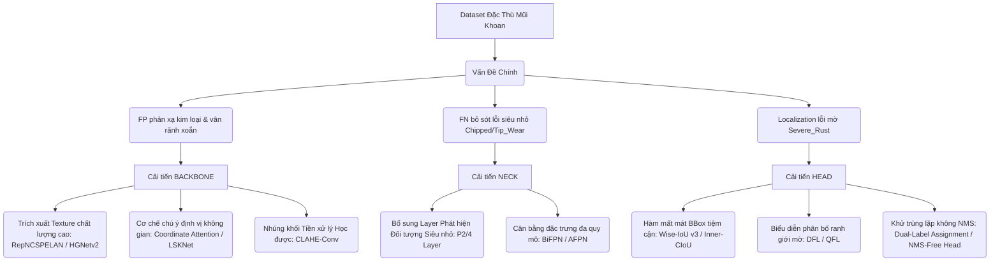

# ĐỀ XUẤT CẢI TIẾN ARCHITECTURE (BACKBONE, NECK, HEAD) & BẢNG ĐÁNH GIÁ RUBICS
## Cho Bài Toán Phát Hiện Lỗi Mũi Khoan (Drill Bit Defect Detection)

Tài liệu này phân tích chi tiết dữ liệu lỗi thu được từ quá trình **Hard Exampling** (phân tích bằng công cụ TIDE và các thống kê lỗi trên tập train/validation) phối hợp với các đặc trưng tập dữ liệu từ báo cáo [EDA README.md](file:///Users/mac/Detect_Drill_Bit/EDA/README.md). Từ đó, chúng tôi đề xuất các hướng cải tiến kiến trúc mô hình (Backbone, Neck, Head) và xây dựng bảng Rubics đánh giá mức độ ưu tiên/khả thi cho từng cải tiến.

---

## 1. Phân Tích Hiện Trạng & Bài Toán Thực Tế

### 1.1. Thống kê lỗi chính từ Hard Exampling ([summary.csv](file:///Users/mac/Detect_Drill_Bit/Hard_Exampling/analysis-valid/summary.csv))
*   **True Positive (TP):** 745
*   **False Positive (FP):** 185 (Gây sụt giảm delta mAP lớn nhất: **15.24%**)
*   **False Negative (FN):** 144 (Gây sụt giảm delta mAP: **2.23%**)
*   **Duplicate Detections (Dupe):** 54 (Gây sụt giảm delta mAP: **1.28%**)
*   **Localization (Loc):** 46 (Gây sụt giảm delta mAP: **4.01%**)
*   **Classification (Cls):** 11 (Tác động rất nhỏ: **0.91%**)

### 1.2. Đặc điểm Dataset ([data.yaml](file:///Users/mac/Detect_Drill_Bit/data/data_convert_yolo_format/data.yaml))
*   **Kích thước dị biệt giữa các Class:** 
    *   *Chipped* (Sứt mẻ - 1.47% diện tích ảnh) và *Tip_Wear* (Mòn mũi - 1.77%) là các đối tượng siêu nhỏ (Tiny Objects).
    *   *Scratched* (Vết xước - 3.20%) có dạng mảnh, kéo dài dọc theo rãnh mũi khoan.
    *   *Severe_Rust* (Rỉ sét nặng - 6.52%) và *Broken* (Mẻ lớn - 7.08%) là vùng lỗi lớn nhưng ranh giới mờ nhạt (Fuzzy boundaries).
*   **Điều kiện ánh sáng phức tạp:** Phân tách thành hai môi trường chiếu sáng **Bright Field** (Trường sáng - dễ bị lóa, phản xạ kim loại mạnh) và **Dark Field** (Trường tối - độ tương phản cực kỳ thấp, vùng xước khó nhận diện).
*   **Vấn đề cốt lõi cần giải quyết:**
    1.  **Hạn chế tối đa False Positive (185 lỗi - Giảm 15.24% mAP):** Mô hình nhận nhầm các vân kim loại, bụi gia công, rãnh xoắn hoặc ánh sáng phản chiếu trên thân mũi khoan là vết xước (*Scratched*) hoặc sứt mẻ (*Chipped*).
    2.  **Giảm thiểu False Negative (144 lỗi):** Bỏ sót các lỗi siêu nhỏ (*Chipped*, *Tip_Wear*) ở vùng đầu mũi khoan và các vết xước mờ dưới ánh sáng kém.
    3.  **Tăng độ chính xác Localization (46 lỗi):** Bbox bị lệch IoU với Ground Truth do hình thái lỗi rỉ sét (*Severe_Rust*) và vết xước (*Scratched*) không có ranh giới rõ ràng.

---

## 2. Đề Xuất Cải Tiến Cấu Trúc Mô Hình (Backbone, Neck, Head)

### 2.1. Hướng Cải Thiện BACKBONE
Backbone chịu trách nhiệm trích xuất đặc trưng thô. Đối với ảnh chụp mũi khoan kim loại, Backbone cần có khả năng phân biệt chi tiết bề mặt (texture) để tránh nhầm lẫn giữa cấu trúc rãnh xoắn bình thường và vết xước/rỉ sét.

*   **Đề xuất 1: Sử dụng RepNCSPELAN (YOLOv12 style) hoặc HGNetv2 làm Backbone.**
    *   *Chi tiết:* Tận dụng cơ chế re-parameterization trong quá trình train (multi-branch) và gộp nhánh khi inference (single-stream). Giúp tăng cường khả năng trích xuất các đường biên sắc nét (lỗi *Chipped*, *Broken*) mà không làm chậm tốc độ suy luận.
*   **Đề xuất 2: Tích hợp cơ chế Attention hướng không gian (Coordinate Attention - CA hoặc LSKNet).**
    *   *Coordinate Attention:* CA mã hóa vị trí chính xác theo trục X và Y vào channel attention. Cực kỳ hiệu quả để định vị lỗi *Tip_Wear* (chỉ xuất hiện ở đầu mũi khoan) và *Scratched* (chạy dọc theo trục rãnh).
    *   *LSKNet (Large Selective Kernel):* Cho phép mô hình điều chỉnh receptive field một cách linh động dựa trên hình dạng kéo dài của vết xước (*Scratched*) hoặc vùng loang lổ của rỉ sét (*Severe_Rust*).
*   **Đề xuất 3: Nhúng khối tăng cường độ tương phản học được (Learnable CLAHE/Preprocessing Block) ở đầu Backbone.**
    *   *Chi tiết:* Một mạng CNN nông (1-2 layer Conv siêu nhẹ) học cách chuẩn hóa dải sáng trực tiếp từ Bright Field và Dark Field trước khi đưa vào các layer trích xuất đặc trưng sâu hơn. Điều này triệt tiêu ảnh hưởng của hiện tượng lóa sáng (giảm mạnh lỗi FP).

---

### 2.2. Hướng Cải Thiện NECK
Neck thực hiện kết hợp các tầng đặc trưng để nhận diện vật thể ở nhiều kích thước khác nhau. Với sự chênh lệch kích thước lớn giữa các loại lỗi trên mũi khoan, Neck hiện tại cần được tối ưu hóa sâu sắc.

*   **Đề xuất 1: Thêm nhánh P2 (Tiny Object Detection Layer - Stride 4).**
    *   *Chi tiết:* YOLOv12n mặc định chỉ sử dụng các tầng đặc trưng P3 (stride 8), P4 (stride 16), P5 (stride 32). Với lỗi *Chipped* chỉ chiếm ~1.47% diện tích ảnh (ví dụ: bbox 10x10 px trên ảnh 640x640), việc truyền thông tin đến tầng P3 (kích thước feature map bị thu nhỏ 8 lần) sẽ làm tiêu biến hoàn toàn đặc trưng của lỗi. Việc bổ sung nhánh P2 (Feature map 160x160) giúp giữ lại các chi tiết góc cạnh tinh tế của vết sứt.
*   **Đề xuất 2: Thay thế PANet truyền thống bằng BiFPN (Bidirectional FPN) hoặc AFPN (Asymptotic FPN).**
    *   *BiFPN:* Sử dụng trọng số học được (Weighted Feature Fusion) để điều phối luồng thông tin từ các tầng khác nhau, đảm bảo đặc trưng của lỗi nhỏ không bị lấn át bởi đặc trưng lỗi lớn.
    *   *AFPN:* Kết hợp thông tin từ các tầng không kề cận một cách từ từ để tránh xung đột ngữ nghĩa (semantic gap), giúp nhận diện chính xác các vết xước dài vắt qua nhiều vùng kích thước.

---

### 2.3. Hướng Cải Thiện HEAD
Head thực hiện nhiệm vụ phân loại (classification) và dự đoán bounding box (regression). Các lỗi định vị (Localization) và nhận diện trùng lặp (Duplicate) sẽ được giải quyết trực tiếp tại đây.

*   **Đề xuất 1: Áp dụng Loss Function tiên tiến Wise-IoU v3 (WIoU v3) hoặc Inner-CIoU.**
    *   *WIoU v3:* Sử dụng cơ chế tập trung động không đơn điệu (dynamic non-monotonic focusing mechanism). Nó giảm thiểu ảnh hưởng của các mẫu huấn luyện quá dễ (vùng không lỗi) và các mẫu quá khó (nhãn bị nhiễu do ranh giới rỉ sét mờ). Điều này giúp cải thiện đáng kể lỗi Localization (được đánh giá sụt giảm 4.01% mAP).
    *   *Inner-CIoU:* Tính toán loss bằng cách đưa thêm các auxiliary bounding box có kích thước nhỏ hơn vào tính toán IoU. Cực kỳ tối ưu cho các vật thể nhỏ như *Chipped*, giúp bám sát biên dạng lỗi.
*   **Đề xuất 2: Áp dụng Distribution Focal Loss (DFL) kết hợp Quality Focal Loss (QFL).**
    *   *Chi tiết:* Thay vì coi tọa độ box là các giá trị đơn lẻ cố định, DFL học phân bố xác suất của các cạnh box. Điều này cực kỳ thích hợp cho các lỗi có biên giới không rõ ràng như *Severe_Rust* và *Scratched*, cho phép mô hình tối ưu hóa bounding box linh hoạt theo vùng chuyển tiếp của vết rỉ sét.
*   **Đề xuất 3: Sử dụng Dual-Label Assignment (NMS-Free Head từ YOLOv10).**
    *   *Chi tiết:* Trong quá trình huấn luyện, mô hình sử dụng cả nhánh one-to-many (để học đặc trưng ổn định) và nhánh one-to-one (để suy luận trực tiếp không cần NMS). Giải pháp này loại bỏ hoàn toàn thuật toán loại bỏ hộp trùng lặp (Non-Maximum Suppression) truyền thống, giải quyết triệt để 54 lỗi Duplicate (gây mất 1.28% mAP) và tăng tốc độ suy luận của mô hình trên thiết bị biên.

---

## 3. Bảng Đánh Giá Rubics Cải Tiến Kiến Trúc

Bảng dưới đây đánh giá chi tiết từng đề xuất cải tiến theo 5 tiêu chí:
1.  **Mức độ giải quyết lỗi (Target Error Impact):** Khả năng khắc phục trực tiếp các lỗi lớn từ TIDE (FP, FN, Loc, Dupe).
2.  **Mức độ phù hợp Dataset (Dataset Fit):** Tương thích với đặc trưng kích thước nhỏ, ranh giới mờ, và điều kiện chiếu sáng của ảnh mũi khoan.
3.  **Độ khó triển khai (Implementation Feasibility):** Tính khả thi khi viết code/custom trong framework Ultralytics YOLO.
4.  **Tác động tài nguyên (FPS & Parameter Overhead):** Mức độ làm tăng dung lượng mô hình và làm chậm tốc độ suy luận.
5.  **Khả năng cải thiện mAP dự kiến (Potential mAP Gain):** Ước lượng mức tăng trưởng mAP tổng thể.

### 3.1. Rubrics Đánh Giá BACKBONE

| Đề xuất cải tiến Backbone | Target Error (TIDE) | Mức độ phù hợp Dataset (High/Medium/Low) | Độ khó triển khai (Dễ / Vừa / Khó) | Tác động tài nguyên (FPS / Params) | Khả năng cải thiện mAP dự kiến | Điểm Ưu Tiên (1-10) |
| :--- | :--- | :--- | :--- | :--- | :--- | :--- |
| **1. RepNCSPELAN / HGNetv2** | **FP** (Hạn chế nhiễu vân rãnh xoắn), **Loc** (Biên dạng rõ hơn) | **High**: Cải thiện khả năng trích xuất texture kim loại dưới ánh sáng phản xạ mạnh. | **Vừa**: Đã được tối ưu sẵn trong thư viện Ultralytics (YOLOv12/v8). | Tăng nhẹ lượng Params khi train; Không ảnh hưởng FPS khi inference (nhờ Rep). | **Trung bình-Cao** (+1.5% đến +2.5%) | **9 / 10** *(Khuyên dùng đầu tiên)* |
| **2. Coordinate Attention (CA)** | **FN** (Lỗi nhỏ ở vị trí đặc thù), **FP** (Hạn chế nhận nhầm trên thân) | **High**: Lỗi *Tip_Wear* chỉ nằm ở đầu mũi khoan; CA giúp khoanh vùng tập trung không gian rất tốt. | **Dễ**: Thêm module CA đơn giản bằng cách chèn định nghĩa lớp vào `ultralytics/nn/modules` và khai báo trong YAML. | Ảnh hưởng cực kỳ nhỏ đến FPS (< 2% latency tăng thêm), thêm rất ít tham số. | **Trung bình** (+1.0% đến +1.8%) | **8.5 / 10** |
| **3. LSKNet (Large Selective Kernel)** | **Loc** (Biên dạng xước dài), **FP** (Lỗi loang rỉ sét) | **High**: Rất khớp với đặc tính kéo dài của vết xước (*Scratched*) và loang lổ của rỉ sét (*Severe_Rust*). | **Khó**: Cần tự cài đặt custom module LSK và cấu hình lại cơ chế kernel selection động. | Tăng đáng kể tính toán nếu dùng kernel quá lớn (giảm 10-15% FPS). | **Cao** (+2.0% đến +3.0%) | **7.5 / 10** |
| **4. Learnable CLAHE Block** | **FP** (Khử lóa sáng ở Bright Field) | **Medium-High**: Giải quyết trực tiếp sự khác biệt lớn giữa Bright Field & Dark Field. | **Vừa**: Viết một module CNN tiền xử lý nhỏ chèn trước Backbone. | Giảm nhẹ FPS (~3-5%) do xử lý ảnh đầu vào ở độ phân giải gốc. | **Trung bình** (+0.8% đến +1.5%) | **7 / 10** |

---

### 3.2. Rubrics Đánh Giá NECK

| Đề xuất cải tiến Neck | Target Error (TIDE) | Mức độ phù hợp Dataset (High/Medium/Low) | Độ khó triển khai (Dễ / Vừa / Khó) | Tác động tài nguyên (FPS / Params) | Khả năng cải thiện mAP dự kiến | Điểm Ưu Tiên (1-10) |
| :--- | :--- | :--- | :--- | :--- | :--- | :--- |
| **1. Bổ sung nhánh P2 (Tiny Object Head - Stride 4)** | **FN** (Tránh lọt lưới các lỗi siêu nhỏ như *Chipped*, *Tip_Wear*) | **High**: Khắc phục triệt để vấn đề thông tin của các defect nhỏ (< 1.5% diện tích) bị triệt tiêu ở các lớp sâu. | **Dễ**: Thay đổi cấu trúc file YAML cấu hình mạng (thêm layer Upsample và Concatenate nối từ layer nông ở Backbone). | **Tăng tải đáng kể**: Feature map P2 rất lớn (160x160), có thể làm giảm 20-30% FPS. | **Rất Cao** (+3.0% đến +5.0% đối với mAP50 các class nhỏ) | **9.5 / 10** *(Trọng tâm cải tiến)* |
| **2. Cấu trúc BiFPN / AFPN** | **Loc** (Định vị box mịn hơn), **FN** (Kết hợp đa quy mô tốt) | **High**: Đảm bảo luồng thông tin kích thước truyền nhận nhất quán từ lỗi cực nhỏ đến lỗi cực lớn. | **Vừa-Khó**: Cần định nghĩa lại các kết nối chéo phức tạp và các trọng số học được trong file định nghĩa mô hình. | Tăng nhẹ lượng tính toán (giảm 5-8% FPS). | **Trung bình-Cao** (+1.5% đến +3.0%) | **8 / 10** |

---

### 3.3. Rubrics Đánh Giá HEAD

| Đề xuất cải tiến Head | Target Error (TIDE) | Mức độ phù hợp Dataset (High/Medium/Low) | Độ khó triển khai (Dễ / Vừa / Khó) | Tác động tài nguyên (FPS / Params) | Khả năng cải thiện mAP dự kiến | Điểm Ưu Tiên (1-10) |
| :--- | :--- | :--- | :--- | :--- | :--- | :--- |
| **1. Wise-IoU v3 (WIoU v3) Loss** | **Loc** (Giảm lệch box ranh giới mờ), **FP** (Hạn chế box nhiễu) | **High**: Lỗi rỉ sét (*Severe_Rust*) và xước (*Scratched*) có biên giới không phân tách rạch ròi. | **Dễ**: Chỉ cần tích hợp công thức WIoU v3 vào file loss function (`loss.py` của YOLO). | **Không thay đổi**: Chỉ thay đổi cách tính loss khi train, tốc độ suy luận khi test giữ nguyên 100%. | **Trung bình-Cao** (+1.2% đến +2.2%) | **9 / 10** *(Cải tiến chi phí 0 đồng)* |
| **2. Distribution Focal Loss (DFL)** | **Loc** (Lỗi lệch bbox của vết xước dài) | **High**: Rất khớp với các vết xước mảnh kéo dài dọc thân mũi khoan, nơi ranh giới hai đầu khó xác định. | **Dễ**: DFL đã được cài đặt mặc định trong YOLOv8/YOLOv12, chỉ cần tinh chỉnh siêu tham số `reg_max` hoặc trọng số loss. | Không ảnh hưởng tài nguyên khi inference. | **Trung bình** (+0.5% đến +1.2%) | **8.5 / 10** |
| **3. Dual-Label Assignment (NMS-Free)** | **Dupe** (Khử lỗi dự đoán trùng lặp), Tăng tốc độ suy luận | **Medium**: Giải quyết trực tiếp 54 lỗi trùng lặp (Duplicate) phát hiện được từ phân tích TIDE. | **Khó**: Đòi hỏi sửa đổi sâu cấu trúc Head và cơ chế gán nhãn tĩnh/động khi train (theo kiến trúc YOLOv10). | **Rất tốt**: Loại bỏ NMS giúp giảm độ trễ suy luận (tăng FPS lên 10-20% trên CPU/Thiết bị nhúng). | **Trung bình** (+0.5% đến +1.0% mAP, tăng mạnh trải nghiệm thực tế) | **7.5 / 10** |

---

## 4. Lộ Trình Huấn Luyện Đề Xuất (Ablation Study)

Để đảm bảo hiệu quả cải tiến cao nhất mà không bị nhiễu do áp dụng quá nhiều thay đổi cùng lúc, chúng tôi khuyến nghị thực hiện các bước kiểm chứng (Ablation Study) theo thứ tự sau:

1.  **Baseline:** Sử dụng YOLOv12n nguyên bản huấn luyện trên dataset sạch (Sau khi lọc trùng và xử lý dữ liệu).
2.  **Experiment 1 (Tối ưu hóa BBox Loss - Dễ nhất):** Áp dụng **Wise-IoU v3** hoặc **Inner-CIoU** thay thế cho CIoU mặc định. 
    *   *Mục tiêu:* Giảm thiểu lỗi **Localization** (AP50 Loc).
3.  **Experiment 2 (Tập trung đối tượng siêu nhỏ - Quan trọng nhất):** Bổ sung nhánh **P2 (Tiny Object Detection Layer)** vào Neck.
    *   *Mục tiêu:* Giảm thiểu lỗi **False Negative** cho *Chipped* và *Tip_Wear*.
4.  **Experiment 3 (Tăng cường trích xuất vị trí):** Tích hợp **Coordinate Attention (CA)** vào vị trí cuối của Backbone.
    *   *Mục tiêu:* Khử các lỗi **False Positive** bị nhận diện nhầm trên phần thân kim loại và tăng mAP lớp *Tip_Wear*.
5.  **Experiment 4 (Kết hợp toàn diện):** Hợp nhất các cải tiến đạt kết quả tốt nhất ở các bước trên để tạo ra mô hình tối ưu cuối cùng.
