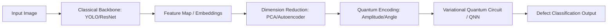

# End-to-End Roadmap for Drill Bit Defect Detection

Based on the dataset found at `/Users/mac/Detect_Drill_Bit/mui_khoan`, it is an object detection dataset formatted in COCO format (from Roboflow). The images are categorized into `train`, `valid`, and `test` sets, and further separated into `Bright_Field` and `Dark_Field` lighting conditions.

The dataset includes the following defect categories:
- `drill` (base class)
- `Broken`
- `Chipped`
- `Scratched`
- `Severe_Rust`
- `Tip_Wear`

Since you want to code it yourself to learn, here is a complete, step-by-step roadmap tailored to this specific dataset.

---

## 1. Exploratory Data Analysis (EDA)

Before building the model, you need to understand the data's characteristics. Write a script (using Python, Pandas, Matplotlib, and OpenCV/PIL) to perform the following:

- **Class Distribution:** Count the number of bounding boxes for each class (`Broken`, `Chipped`, `Scratched`, etc.) in the `train`, `valid`, and `test` splits. Is the data imbalanced? (e.g., lots of `Scratched` but very few `Severe_Rust`).
- **Bounding Box Analysis:** Plot a scatter plot of bounding box widths vs. heights. This helps you understand the size of the defects (are they tiny spots or do they cover the whole drill bit?).
- **Lighting Comparison:** Randomly visualize 5 images from `Bright_Field` and 5 from `Dark_Field` with their bounding boxes drawn. Observe how the defects appear under different lighting.
- **Split Ratio Check:** Verify the ratio of images across the `train`, `valid`, and `test` folders (usually 70/20/10 or 80/10/10 is ideal).

## 2. Data Preprocessing

Prepare the dataset so that your deep learning model can digest it easily.

- **Format Conversion (Recommended):** Most modern state-of-the-art models like YOLOv8 use the YOLO format (`.txt` files) instead of COCO JSON. Write a script to convert `_annotations.coco.json` into YOLO format. For each image, you should have a corresponding `.txt` file containing lines: `<class_id> <x_center> <y_center> <width> <height>` (all normalized between 0 and 1).
- **Image Resizing:** The JSON indicates images are `448x448`. Keep them at this resolution or resize to a standard multiple of 32 (like `640x640`) if you use larger models.
- **Lighting Normalization (Optional but good):** Since you have `Dark_Field` images, you might want to experiment with applying **CLAHE (Contrast Limited Adaptive Histogram Equalization)** to enhance the defect features in dark images.

## 3. Data Augmentation (Basic & Advanced)

To make your model robust and prevent overfitting (especially if the dataset is small), apply both basic and advanced defect-specific augmentations. The `albumentations` library is highly recommended for object detection because it adjusts bounding boxes automatically.

### Basic Augmentations
- **Spatial Augmentations:**
  - Random Horizontal and Vertical Flips.
  - Random Rotation (e.g., $\pm 15$ degrees). Drill bits can be oriented differently on the assembly line.
- **Color/Lighting Augmentations:**
  - Random Brightness and Contrast (helps the model generalize between Bright and Dark fields).
  - Gaussian Blur or Gaussian Noise (simulates out-of-focus cameras or sensor noise).

### Advanced Defect-Specific Augmentations
- **Copy-Paste Augmentation (CutMix / Copy-Paste):**
  - Defect detection benefits immensely from pasting defects (e.g., a "Chipped" edge or "Severe_Rust" texture) from one image onto a clean area of another drill bit. You can implement this using `Albumentations` or YOLO's native copy-paste augmentation settings to resolve class imbalances.
- **Domain Matching / Alignment:**
  - Since you have `Bright_Field` and `Dark_Field` images, the model might struggle to transfer learning between lighting conditions. 
  - Apply **Histogram Matching** or **Color Transfer** to artificially make a `Bright_Field` image look like a `Dark_Field` image, and vice versa. This effectively doubles your dataset size across domains.
- **Class-Aware Oversampling:**
  - If the `Severe_Rust` class has only 10 examples while `Chipped` has 200, configure your data loader to sample images containing `Severe_Rust` more frequently during training, applying heavier rotations and elastic transformations to them.
- **Advanced Native Augmentations (if using YOLO):**
  - **Mosaic:** Combines 4 images into one, helping the model detect smaller defects.
  - **MixUp:** Blends two images together.

## 4. Evaluate Data After Augmentation

Never train on augmented data without visually inspecting it first!

- **Sanity Check Script:** Write a script to generate 20 augmented images and draw the augmented bounding boxes.
- **Check for clipping:** Ensure that rotations/crops didn't cut off the defects or leave bounding boxes floating outside the image boundaries.
- **Color distortion check:** Ensure the contrast/brightness changes didn't make the defect completely invisible to the human eye. If you can't see it, the model won't either.

## 5. Model Selection, Training & Hybrid Quantum Research

For real-time defect detection, the **YOLO (You Only Look Once)** family is currently the industry standard (e.g., **Ultralytics YOLOv8 or YOLOv10**). Additionally, once you have a fully trained classical model, you can research wrapping it with **Quantum Machine Learning (QML)** techniques to explore model size reduction and feature representation.

### Classical Model & Training
- **Environment Setup:** Install the `ultralytics` package.
- **Create `data.yaml`:** Point to your dataset paths (`train`, `val`, `test` directories) and list the class names.
- **Transfer Learning:** Start with a pre-trained model (e.g., `yolov8n.pt` for nano or `yolov8s.pt` for small) to speed up convergence.
- **Hyperparameters to tune:**
  - `epochs`: Start with 50-100.
  - `imgsz`: 448 or 640.
  - `batch`: 16 or 32.
  - `optimizer`: `AdamW` or `SGD`.

### Post-Training Hybrid Quantum Research
Once trained classically, you can explore if Parameterized Quantum Circuits (PQCs) can perform better non-linear mapping or classification with fewer parameters.

- **Why Hybrid?**
  - Pure quantum computing cannot process high-resolution images yet because of the limited number of qubits (NISQ era).
  - A hybrid setup uses a **classical backbone** (e.g., the backbone of your trained YOLO model or a ResNet) to extract feature embeddings, and a **variational quantum circuit (VQC)** to act as the classification or bounding box correction head.
- **Step-by-Step Research Approach:**
  1. **Feature Extraction:** Pass your drill bit images through your trained classical model and extract the features before the final classification head (e.g., a 128-dimensional embedding vector).
  2. **Dimension Reduction:** Current quantum simulators (like PennyLane or Qiskit) simulate 4 to 10 qubits efficiently. Use classical **PCA (Principal Component Analysis)** or an **Autoencoder** to compress the 128-dimensional embedding vector down to 4 or 8 features.
  3. **Quantum State Embedding:** Map these features to qubits using Angle Embedding or Amplitude Embedding.
  4. **Variational Quantum Circuit (VQC):** Build a parameterized quantum circuit using rotation gates ($R_y, R_z$) and entangling CNOT gates.
  5. **Hybrid Training:** Use libraries like **PennyLane** (integrated with PyTorch) to backpropagate gradients from the quantum circuit back into the classical weights. Compare if the quantum classifier matches or exceeds the classical linear layer accuracy on your test set.

## 6. Evaluation & Inference

Once training is complete, evaluate how well the model performs on unseen data.

- **Metrics:** Look at the **mAP@0.5** (Mean Average Precision at 50% overlap) and **mAP@0.5:0.95**. Also, check the confusion matrix.
- **Error Analysis:**
  - **False Positives:** Did the model detect a scratch where there is none? (Maybe just a reflection from the bright field).
  - **False Negatives:** Did the model miss a chipped tip?
  - Are some classes confused with each other? (e.g., `Broken` vs `Chipped`).
- **Inference Script:** Write a small script using `cv2.VideoCapture` or image loading to run your trained `.pt` model on the `test` directory images and save the output predictions to review them.

## 7. API Development (Serving the Model)

To make your model accessible to other applications, you need to wrap it in a REST API. **FastAPI** is highly recommended for this due to its speed and automatic documentation.

- **Setup:** Install `fastapi`, `uvicorn`, and `python-multipart`.
- **Endpoints:**
  - `POST /predict`: An endpoint that accepts an image file upload.
- **Logic:**
  1. Receive the uploaded image.
  2. Pass the image to your trained YOLO model for inference.
  3. Format the results (bounding boxes, class names, confidence scores).
  4. Return the results as a JSON response.
- **Testing:** Run the server locally using `uvicorn main:app --reload` and test it using the built-in Swagger UI at `http://localhost:8000/docs`.

## 8. User Interface (UI) Development

Build a simple frontend so users can easily upload images and see the defect detections visually without using command-line tools or raw JSON.

- **Option A (Quickest - Python-based):** Use **Streamlit** or **Gradio**. These allow you to build an interactive web app in just a few lines of Python code. You can have an image upload widget, and display the returned image with bounding boxes drawn on it.
- **Option B (Custom Web App):** Build a frontend using **HTML/Vanilla JS** or **React/Next.js**. 
  - Create a clean, modern interface with drag-and-drop file upload.
  - Send the image to your FastAPI backend via `fetch` or `axios`.
  - Draw the returned bounding boxes over the image using an HTML5 `<canvas>`.

## 9. Containerization (Docker)

To make your application easy to deploy and run anywhere without environment setup issues, containerize it using Docker.

- **Dockerfile for API:**
  - Start with a base Python image (e.g., `python:3.10-slim`).
  - Install necessary system dependencies (like `libgl1-mesa-glx` for OpenCV).
  - Copy your `requirements.txt` and install Python packages.
  - Copy your FastAPI code and the trained `.pt` model weights.
  - Expose port `8000` and set the `CMD` to run Uvicorn.
- **Dockerfile for UI (If separate):** Create another Dockerfile if your UI is a separate React/Next.js app. If using Streamlit, you can add it to the same or a different container.
- **Docker Compose:** Create a `docker-compose.yml` file to spin up both the API backend and the UI frontend together with a single `docker-compose up -d` command.

## 10. Deployment to Hugging Face (or Alternative Cloud Platforms)

Deploying your model to a public platform makes it easy to share. Hugging Face is the most developer-friendly space for hosting ML demos.

- **Option A: Hugging Face Spaces (Streamlit/Gradio App):**
  1. Create a new Space on Hugging Face and choose the **Streamlit** or **Gradio** SDK.
  2. Git clone the Space repository.
  3. Upload your UI script, Python requirements (`requirements.txt`), and your trained YOLO `.pt` weights.
  4. Hugging Face will automatically build and host the UI. (Note: Since YOLO is lightweight, it runs perfectly on Hugging Face's free CPU tier).
- **Option B: Hugging Face Spaces (Docker Space):**
  - If your API and UI need to run together, choose the **Docker** SDK when creating a Hugging Face Space. Provide a `Dockerfile` that spins up both the FastAPI backend and your UI.
- **Option C: Alternative Cloud Providers (AWS/GCP/Render):**
  - Deploy your Docker image to **Render** or **Railway** (easier/free tiers) or to **AWS ECS/GCP Cloud Run** for production-grade scaling.

---

> [!TIP]
> **Your Next Steps:**
> Since you want to code this yourself, I recommend starting with **Step 1 (EDA)**. Try writing a Python script to parse the `_annotations.coco.json` file and plot a bar chart of the class counts. Let me know if you get stuck on the code or need hints!

## User Review Required

Does this roadmap align with your learning goals? If you'd like, I can provide the skeleton code (just the structure without the implementation) for the EDA script to get you started!
